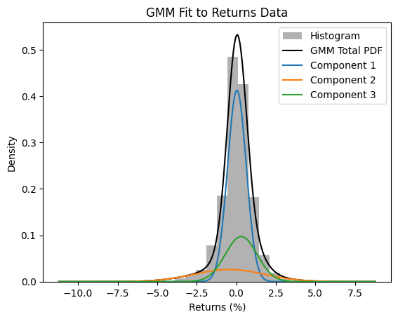
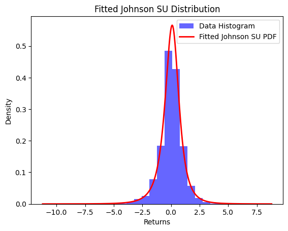

# Financial-asset distribution fit

The purpose of this repo is to investigate the statistical behaviour of the World Index of Stocks known as MSCI ACWI which
consists of a majority weight in developed markets (Global stocks) and a minority weight in Emerging Markets. 

More information about MSCI ACWI: https://www.msci.com/indexes/index/892400

April 2025

## 🔑 Keywords 

SciPy, Sci-kit learn, Yahoo Finance, datetime, Python, Python Pandas

## Introduction

Understanding risk is central to any investment endeavor. Legendary investor Warren Buffett famously stated:

"The first rule of investment is don't lose. The second rule is don't forget the first rule."

To understand risk, one must examine the statistical properties of return distributions, which is a notoriously difficult task.

In undergraduate finance-courses, the tools commonly taught, such as the Capital Asset Pricing Model (CAPM) and the Sharpe Ratio, rely on first- and second-order statistics (variance and standard deviation), while ignoring higher-order effects. A distribution fully described by these lower-order moments is known as Gaussian (or Normal).

However, in practice, stock returns are not Gaussian — a fact well established in financial research.
The purpose of this project is to demonstrate this deviation from normality and explore alternative models that better capture the true nature of financial returns.

## Method

I fit a Gaussian distribution to ten years of MSCI ACWI daily total-returns, starting at the 24th of April 2025. The same data was used to fit Jonhson SU and Tukey Lambda distributions as well as a Gaussian Mixture Model. Tukey Labda and Jonson SU are popular in financial modelling due to their superior ability to capture heavy tails (extreme positive or negative values that are very unlikely under a Gaussian framework). The accuracy of the distributions are compared using the Kolmogorov-Smirnov test on three years of out-of-sample data.

## Results 

The results of the experiment is presented below. The KS statistic measures the distance between the observed results and the estimated PDF so a lower value indicates a better fit.  
On the other hand, a higher p-value is considered better because it indicates a higher confidence that the distribution is a good fit.

| Distribution         | KS Statistic | P-Value     |
|----------------------|--------------|-------------|
| **Gaussian**         | 0.1131       | 8.1e-09     |
| **Johnson SU**       | 0.0387       | 0.2064      |
| **Tukey Lambda**     | 0.0458       | 0.0828      |
| **GMM (9 modes)**    | 0.0452       | 0.0897      |

The two best distributions were Johnson SU and Gaussian Mixture Model with 9 components ('modes'). Graphs of these fits can be seen below:

 
## Conclusions

As expected, the Gaussian distribution performed poorly — with a KS p-value several orders of magnitude below the rest.

Every other distribution significantly outperformed the Gaussian assumption. Interestingly, the GMM slightly edged out Tukey Lambda in this case, highlighting its ability to capture local structure and multi-modality in return distributions.

