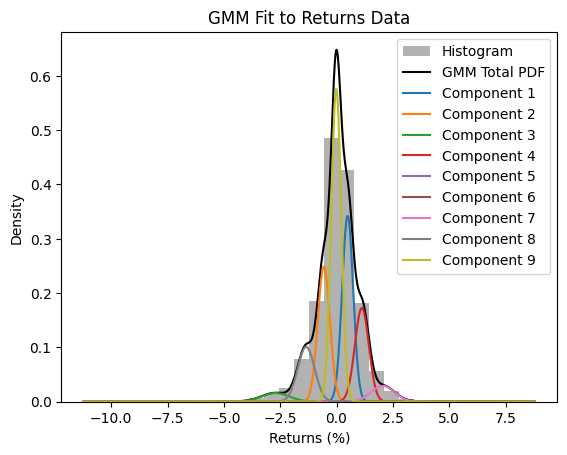

# Financial-asset return-distribution estimation

The purpose of this repo is to investigate the statistical behaviour of the World Index of Stocks known as MSCI ACWI which
consists of a majority weight in developed markets (Global stocks) and a minority weight in Emerging Markets. 

Erik Martin Welin, 2025

## 🔑 Keywords 

SciPy, Sci-kit learn, Yahoo Finance, datetime, Python, Python Pandas

Date January 2025.

## Introduction

Understanding risk is central to any investment endeavor. Legendary investor Warren Buffett famously stated:

"The first rule of investment is don't lose. The second rule is don't forget the first rule."

To understand risk, one must examine the statistical properties of return distributions, which is a notoriously difficult task.

In undergraduate finance-courses, the tools commonly taught, such as the Capital Asset Pricing Model (CAPM) and the Sharpe Ratio, rely on first- and second-order statistics (variance and standard deviation), while ignoring higher-order effects. A distribution fully described by these lower-order moments is known as Gaussian (or Normal).

However, in practice, stock returns are not Gaussian — a fact well established in financial research.
The purpose of this project is to demonstrate this deviation from normality and explore alternative models that better capture the true nature of financial returns.

## Method

I fit a Gaussian distribution to ten years of MSCI ACWI daily total-returns, starting at the 24th of April 2025. The same data was used to fit Jonhson SU and Tukey Lambda distributions as well as a Gaussian Mixture Model. Tukey Labda and Jonson SU are popular in financial modelling to their superior ability to capture heavy tails (extreme positive or negative values that are very unlikely under a Gaussian framework). The accuracy of the distributions are compared using the Kolmogorov-Smirnov test on three years of out-of-sample data.

## Results 

The results of the experiment is presented below. The KS statistic measures the distance between the observed results and the estimated PDF so a lower value is better.
On the other hand, a higher p-value is better because it indicates higher confidence that the distribution is a good fit.

The two best distributions were Johnson SU and Gaussian Mixture Model with 9 components ('modes'). Graphs of these fits can be seen below:

=== Gaussian ===
Parameters: mean=0.037760068414518635, standard deviation=1.1072097227036375  
KS Statistic: [0.11306013]  
P-Value: [8.10190651e-09]

=== Johnson SU ===
Parameters: a=0.1046772810873723, b=1.1400055678255596, loc=0.1487844110017341, scale=0.8020460624157375  
KS Statistic: [0.03865402]  
P-Value: [0.20638882]

=== Tukey Lambda ===
Parameters: loc=0.0769003229605155, scale=0.3799193834238573  
KS Statistic: [0.04581586]  
P-Value: [0.08283883]  

=== Gaussian Mixture Model ===

K-S Statistic: [0.04523505], P-value: [0.08972478]  
GMM Parameters: Number of modes: 9  
Weights: [0.21040101 0.16711765 0.02451683 0.13335396 0.0049533  0.00525492  
 0.03814666 0.0949338  0.32132187]  
Means: [ 0.49199266 -0.56412103 -2.71209047  1.12247798 -5.60135908  5.15930895  
  2.05214492 -1.3479226  -0.01357436]  
Covariances: [0.06011377 0.07175123 0.37331606 0.09497687 7.75101998 4.09494426  
 0.27043805 0.14013863 0.04954631]

## Conclusions

As expected the Gaussian fit to the data was extremely poor as was indicated by a P-statistic many orders of magnitude below the other distributions. Stock returns are still not Gaussian.
An interesting outcome is that GMMs very slightly outperformed the much used Tukey Lambda distribution.

